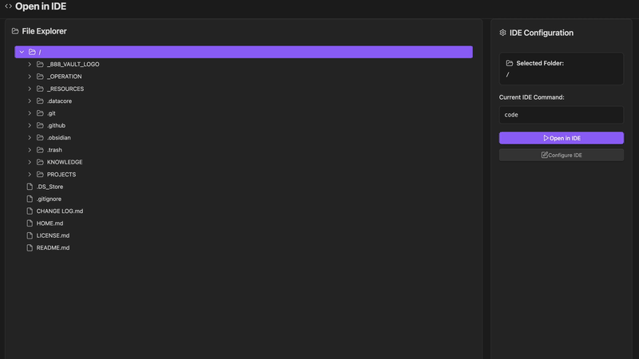

  
  
  <h1 align="center">OPEN IDE</h1>
  <h3 align="center"> Browse Vault & Open Files Instantly in External Code Editors </h3>

  <!-- TOP PURPLE LINKS -->
  
  
  
   
  <!-- BOTTOM GOLD TAXONOMY -->
  
  
  
  

  

    <i> A developer utility bridge component that allows you to browse your vault and open files/folders directly in your favorite desktop editor. </i>
  

  

Welcome to **OpenIDE**, a simple system integration tool designed to speed up external file editing workflows. Instead of manually locating notes inside your operating system's explorer, OpenIDE lets you browse the entire vault structure and launch external editors instantly with a single click.

---

## Quick Start

To start using OpenIDE today:
1. **Download the Repository**: Clone or download this repository directly into any folder inside your Obsidian vault.
2. **Install Datacore**: Ensure you have the **Datacore** plugin installed and enabled in Obsidian.
3. **Open the Entry Note**: Open the **`OPEN IDE.md`** note inside Obsidian to launch the component!

---

## Features

### Full Vault File Explorer
*   **Tree Navigation**: Renders a clean, navigable tree-explorer showing all folders and markdown files in the vault.
*   **Lazy Loading**: Caches and lazy-loads sub-directories dynamically for lightweight, speedy navigation.

### System Editor Spawning
*   **Detached Processes**: Spawns detached processes to launch desktop editors (VS Code, Cursor, Sublime Text, etc.) passing the absolute file or folder path.
*   **Cross-Platform Shell Support**: Intelligently routes shell calls under Windows (`cmd`) and macOS/Linux (`/bin/sh`).
*   **Terminal Editors**: Handled separately to spin up custom editor instances for neovim or vim.

### Persistent Command Settings
*   **Command Setup**: Prompts to set up the editor execution command (e.g. `code`, `cursor`, `nvim`) on first launch.
*   **localStorage Preservation**: Preferences are saved locally to avoid recurrent configuration prompts.

---

## Directory Index & Components

The package exposes the following files:

| File | Description |
| :--- | :--- |
| **[OPEN IDE.md](OPEN%20IDE.md)** | The main entry point leaf designed to be loaded inside Obsidian panes. |
| **[example/EXAMPLE.md](example/EXAMPLE.md)** | Documentation showing how to mount this component on custom markdown pages. |
| **[src/index.jsx](src/index.jsx)** | Handles FullTab reparenting wrapper, custom CSS overrides, and the developer auto-reload Safe Agent loop. |
| **[src/App.jsx](src/App.jsx)** | Preact workspace explorer, configuration panels, and Node.js child process spawning bridge code. |
| **[METADATA.md](METADATA.md)** | Machine-readable manifest outlining versioning, category, and indexed packages. |
| **[CONTRIBUTION.md](CONTRIBUTION.md)** | Contributor architecture standards and modular requirements. |
| **[LICENSE.md](LICENSE.md)** | MIT open-source license. |

---

## Previews

| Static Mockup | Interactive File Explorer |
| :---: | :---: |
|  |  |

---

## Contributors
- beto.group
